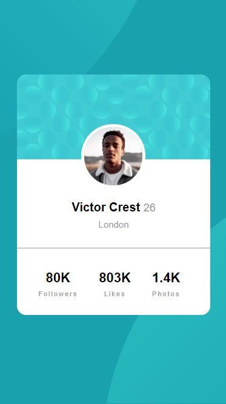

# Frontend Mentor - 3-column preview card component solution

This is a solution to the [3-column preview card component challenge on Frontend Mentor](https://www.frontendmentor.io/challenges/3column-preview-card-component-pH92eAR2-). Frontend Mentor challenges help you improve your coding skills by building realistic projects. 

## Table of contents

- [Overview](#overview)
  - [The challenge](#the-challenge)
  - [Screenshot](#screenshot)
  - [Links](#links)
- [My process](#my-process)
  - [Built with](#built-with)
  - [What I learned](#what-i-learned)
- [Author](#author)

## Overview

### The challenge

Users should be able to:

- View the optimal layout depending on their device's screen size
- See hover states for interactive elements

### Screenshot

### Links

- Solution URL: [Solution](https://www.frontendmentor.io/solutions/tools-used-none-just-a-bit-of-html-and-css-MzFJKCVy7)
- Live Site URL: [Live site](https://sklady.netlify.app/challengesfrontedmentor/3-column-preview-card-component/index.html)

## My process

I started with HTML first, then added all the styling with CSS.

I made sure that the website would be **responsive** and not *static*, meaning the website will change based on the width of the user's device, that's being used to view the website.

### Built with

- Semantic HTML5 markup (Just a little)
- CSS custom properties
- Mobile-first workflow

### What I learned

I learned the basic styling of buttons... yay!

## Author

- Frontend Mentor - [@Hikki666](https://www.frontendmentor.io/profile/Hikki666)
- E-mail - jan.skladany1234@seznam.cz