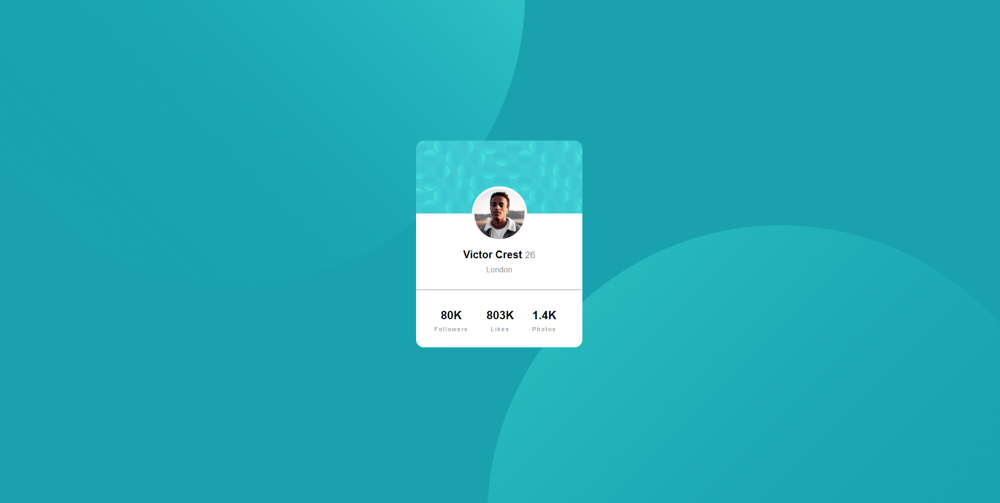

# Frontend Mentor - Profile card component solution

This is a solution to the [Profile card component challenge on Frontend Mentor](https://www.frontendmentor.io/challenges/profile-card-component-cfArpWshJ). Frontend Mentor challenges help you improve your coding skills by building realistic projects. 

## Table of contents

- [Overview](#overview)
  - [The challenge](#the-challenge)
  - [Screenshot](#screenshot)
  - [Links](#links)
- [My process](#my-process)
  - [Built with](#built-with)
- [Author](#author)

## Overview

### The challenge

Users should be able to:

- View the optimal layout depending on their device's screen size

### Screenshot

### Links

- Solution URL: [Solution](https://www.frontendmentor.io/solutions/tools-used-none-just-html-and-css-_AY5_7qdt)
- Live Site URL: [Live site](https://sklady.netlify.app/challengesfrontedmentor/profile-card-component-main/index.html)

## My process

I started with HTML first, then added all the styling with CSS.

### Built with

- Semantic HTML5 markup (Just a little)
- CSS custom properties
- Mobile-first workflow

## Author

- Frontend Mentor - [@Hikki666](https://www.frontendmentor.io/profile/Hikki666)
- E-mail - jan.skladany1234@seznam.cz